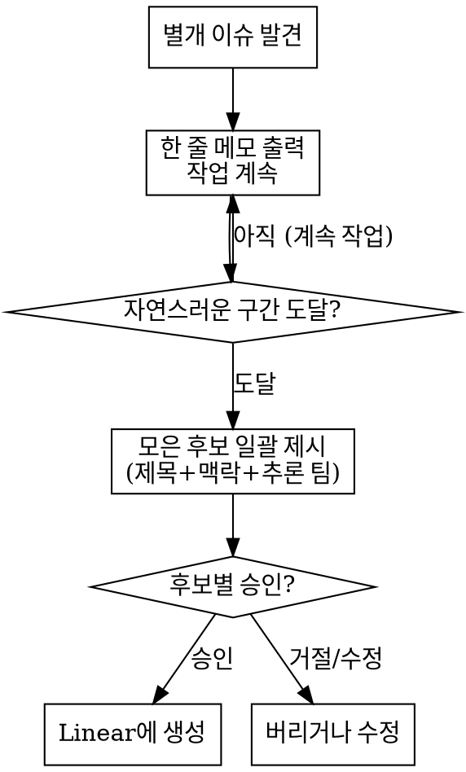

# Capturing Side Issues

## 핵심 원칙

작업 도중 **지금 범위 밖이지만 따로 처리해야 할 이슈**를 발견하면, 그 자리에서 고치지(derail) 말고 잃어버리지도(forget) 말 것. 포착해서 Linear에 남기되, **생성은 사용자가 후보별로 승인했을 때만** 한다.

Linear는 기본 read-only다. 이 스킬은 "사용자가 후보를 승인한 순간"에 한해서만 write를 허용하는 유일한 예외다.

## 무엇이 "별개 이슈"인가

포착 대상 (capture):
- 현재 task와 무관한 버그/결함을 우연히 발견
- 손대고 있는 코드 주변의 tech debt, 깨진 링크, 누락된 처리
- "나중에 해야 할" follow-up, 후속 작업
- 비개발 작업(문서 정리, 리서치 등)에서 나온 별도 처리 필요 항목

포착 대상 아님 (skip):
- 현재 task를 끝내는 데 꼭 필요한 일 → 그냥 지금 한다
- 사소해서 굳이 추적할 가치 없는 것
- 이미 등록돼 있는 이슈

## 흐름



### 1. 포착 즉시 — 한 줄 메모 + 계속 진행
이슈를 발견한 그 순간, 작업을 멈추지 말고 한 줄만 출력한다:

> 📌 별개 이슈 포착: <한 줄 요약>

그리고 현재 task를 계속한다. 후보는 내부적으로 기억해 둔다 (여러 개면 TodoWrite에 한 줄씩 적어 추적해도 좋다). **여기서 승인을 묻지 않는다** — 흐름을 끊지 않는 게 목적이다.

### 2. 자연스러운 구간 — 일괄 제시
"자연스러운 구간" = 현재 task/step이 끝났을 때, 사용자가 잠깐 멈췄을 때, 또는 세션을 마치기 직전. 이때 모아 둔 후보를 한꺼번에 제시한다. 후보 하나당:

- **Title** (영어, 간결): commit/issue 관행을 따른 한 줄 요약
- **맥락** (한국어): 무슨 이슈인지 · 어디서 나왔는지(파일/상황) · 왜 현재 작업과 별개인지
- **대상 팀/프로젝트**: 현재 repo·디렉토리·작업 맥락으로 추론한 기본값을 제시. Linear MCP read 도구로 팀 목록을 가져와 가장 가까운 것을 고른다. 추론이 애매하면 후보 팀 몇 개를 같이 보여주고 고르게 한다.
- **중복 의심**: 생성 전 Linear MCP read(search)로 비슷한 기존 이슈가 있는지 가볍게 훑어, 의심되면 함께 표시한다.

### 3. 승인 게이트 — 승인된 것만 생성
사용자가 후보별로 **승인 / 수정 / 버림**을 결정한다. 여러 개를 한 번에 승인할 수 있다. **승인된 후보만** Linear MCP의 이슈 생성(write) 도구로 만든다. 생성 후 만들어진 이슈 링크/식별자를 알려준다.

## 절대 하지 말 것

- 후보별 명시적 승인 없이 Linear에 create/update/delete — 이 스킬의 존재가 "무조건 만들어도 된다"는 허가가 아니다. 매 후보마다 승인이 필요하다.
- 포착한 이슈를 "기왕 보인 김에" 그 자리에서 고치는 것 (= derail). 현재 task를 우선한다.
- 포착 즉시 작업을 멈추고 승인을 묻는 것 — 1번은 한 줄 메모일 뿐, 질문이 아니다.
- 사소한 것/현재 task의 일부인 것까지 후보로 남발하는 것.
- Title을 한국어로, 맥락 설명을 영어로 쓰는 것 (반대다: Title 영어, 맥락 한국어).

## Red Flags — 멈추고 다시 생각

| 떠오른 생각 | 실제로 해야 할 것 |
|---|---|
| "이왕 발견한 김에 지금 고치자" | derail이다. 메모만 하고 현재 task 계속. |
| "이건 바로 등록 여부 물어봐야지" | 1번은 한 줄 메모. 승인은 자연스러운 구간에서 모아서. |
| "스킬 만들었으니 알아서 생성하면 되지" | 아니다. 후보별 사용자 승인이 항상 필요. |
| "팀은 대충 아무 데나 넣자" | 맥락으로 추론한 기본값 제시 + 확인. 애매하면 고르게. |
| "작은 거니까 그냥 무시" | 추적 가치 있으면 메모. 정말 사소하면 skip — 남발도 금지. |

## Example

작업: A 모듈 리팩터링 중.
도중 B 함수에서 무관한 null 처리 누락 발견.

```
📌 별개 이슈 포착: parseConfig() missing null guard (현재 리팩터링과 무관)
```
(→ 리팩터링 계속)

리팩터링 task 종료 시점:

> 작업 중 포착한 별개 이슈 1건이 있어요:
>
> **Title**: `config: Add null guard in parseConfig`
> **맥락**: A 모듈 리팩터링 중 `config/parse.ts:42`의 `parseConfig()`가 입력이 null일 때 그대로 throw하는 걸 발견했어요. 현재 리팩터링 범위(A 모듈)와는 별개라 따로 둡니다.
> **대상 팀**: `Backend` (현재 repo 맥락으로 추론) — 맞을까요?
> **중복**: 비슷한 기존 이슈는 안 보였어요.
>
> 등록할까요?

승인 시 → Linear MCP 이슈 생성 도구 호출 → 생성된 이슈 링크 회신.
